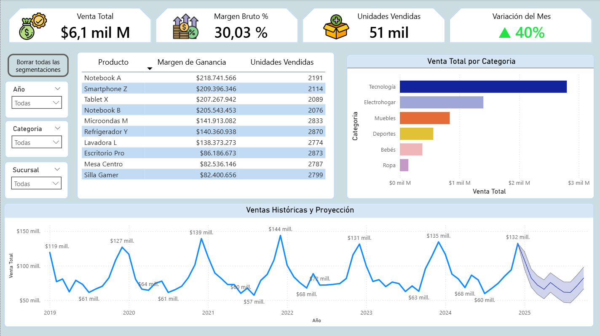
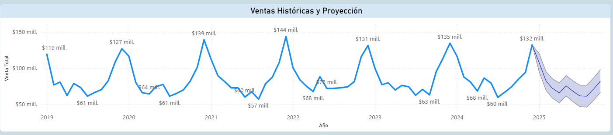
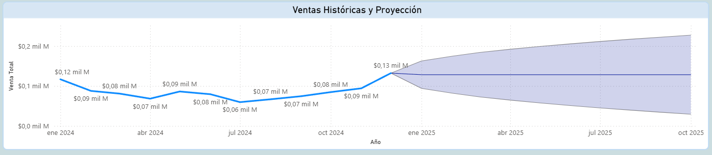
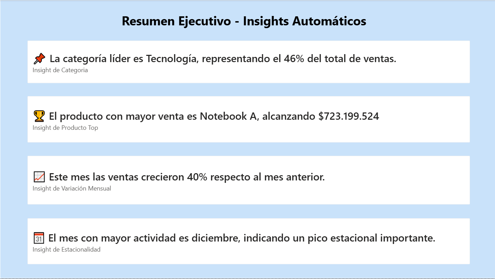
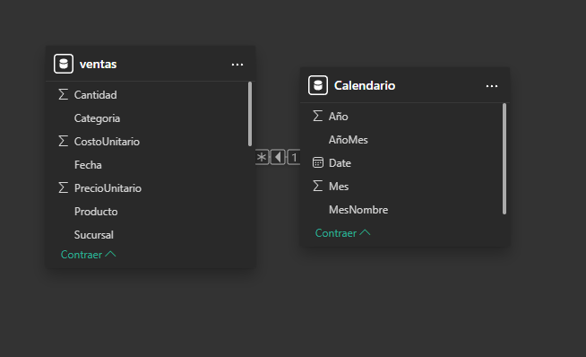

# 🛒 **Dashboard de Ventas – Análisis Histórico y Proyección (Power BI)**

Este proyecto presenta un **dashboard profesional de ventas**, con análisis histórico y pronóstico futuro utilizando **Power BI**, ideal para portafolio de *Data Analytics / BI*.
Incluye insights automáticos, forecast, KPIs y segmentación avanzada.

---

## 📊 **Vista General del Dashboard**



---

## 📁 **Estructura del Proyecto**

```
📦 Dashboard-Ventas-PowerBI
 ┣ 📂 dataset
 ┃ ┗ ventas_predicitvo_2019_2024.csv
 ┣ 📂 img
 ┃ ┣ Forecast.png
 ┃ ┣ Insights Automaticos.png
 ┃ ┣ KPIS.png
 ┃ ┣ Modelado.png
 ┃ ┣ VistaGeneral1.png
 ┃ ┣ VistaGeneral3.png
 ┃ ┣ Visualizaciones1.png
 ┃ ┗ Visualizaciones2.png
 ┣ 📂 pbix
 ┃ ┗ Dashboard_Ventas.pbix
 ┗ README.md
```

---

## 🧠 **Objetivo del Proyecto**

Desarrollar un dashboard que permita:

✔ Analizar ventas históricas desde 2019 a 2024
✔ Predecir ventas futuras mediante Power BI Forecast
✔ Detectar estacionalidad y tendencias
✔ Identificar productos y categorías líderes
✔ Analizar sucursales y su contribución
✔ Generar insights automáticos para la toma de decisiones

---

## 🚀 **KPIs Principales**


* **Ventas Totales**
* **Margen Bruto %**
* **Unidades Vendidas**
* **Variación del Mes %**

---

## 📈 **Visualizaciones Incluidas**



* Venta total por categoría
* Ranking de productos
* Tendencia histórica con forecast
* Tabla de margen y unidades
* Segmentación por año, categoría y sucursal

---

## 🔮 **Forecast / Proyección**



* Predicción de **12 meses hacia adelante**
* Estacionalidad automática
* Intervalo de confianza del 95%

---

## 🤖 **Insights Automáticos**



Algunos insights generados:

* 📌 Tecnología es la categoría líder con ~46% de ventas
* 🏆 Notebook A es el producto más vendido
* 📈 Las ventas del mes crecieron un 40%
* 📅 Diciembre es el mes con mayor actividad histórica

---

## 🧩 **Modelo de Datos**



### Tabla Calendario

```DAX
Calendario =
ADDCOLUMNS(
    CALENDAR(DATE(2019,1,1), DATE(2025,12,31)),
    "Año", YEAR([Date]),
    "Mes", MONTH([Date]),
    "MesNombre", FORMAT([Date], "mmmm"),
    "AñoMes", FORMAT([Date], "YYYY-MM")
)
```

---

## 📐 **Medidas DAX Principales**

### **Venta Total**

```DAX
Venta Total = SUMX(ventas, ventas[Cantidad] * ventas[PrecioUnitario])
```

### **Venta Mes Anterior**

```DAX
Venta Mes Anterior =
CALCULATE([Venta Total], DATEADD(Calendario[Date], -1, MONTH))
```

### **Variación Mes %**

```DAX
Variación Mes % =
VAR actual = [Venta Total]
VAR anterior = [Venta Mes Anterior]
RETURN DIVIDE(actual - anterior, anterior)
```

---

## 🛠 **Tecnologías Utilizadas**

* Power BI Desktop
* DAX
* Modelado de Datos
* Técnicas de Forecast
* Insights automáticos (Smart Narrative)

---

## 📥 **Cómo utilizar el Dashboard**

1. Descarga el archivo **`.pbix`** desde la carpeta `/pbix/`.
2. Abre en **Power BI Desktop (2023 o superior)**.
3. Explora filtros, pronóstico y visualizaciones interactivas.

---

## 👨‍💻 **Autor**

**Valentina Valdivia**
💼 Data Analyst · Power BI · SQL
📍 Chile 🇨🇱

---

## 📝 **Licencia**

Este proyecto es de uso personal y demostrativo. Puedes reutilizarlo con créditos.
